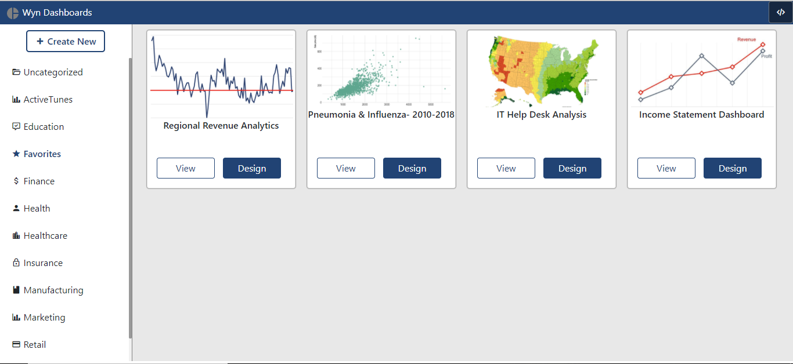

# EmbedWynDashboardsViaDiv
Sample to show integration of Wyn Designer &amp; Viewer using Div in a web application

This sample showcases the newly added APIs in Wyn Enterprise to integrate the Wyn Designer and Viewer components in a web application via Div.

Here's a sample screen shot of the output on running this sample

**Steps to run the sample**
1. Open the Admin portal on your Wyn Server
2. Go to 'System Configurations'
3. Add 'http://localhost:59897' under the 'Allowed CORS Origins' section and click Save (This URL may be different based on where you choose to host the web application)
4. Now open Login.html from the project
5. Enter the Wyn Server Url, username, password and click Login
